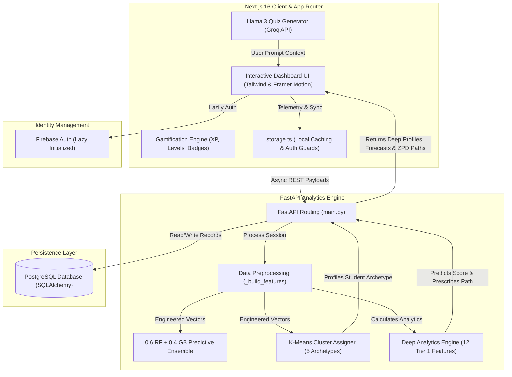

# Aura Learn — Comprehensive Technical Reference & Architecture Documentation

Welcome to the definitive architectural manual and technical reference for **Aura Learn** (formerly Aura Insights / Quiz Generator). 

This system is a **Predictive Behavioral Learning Management System (LMS)** that bridges generative AI and predictive behavioral analytics. By capturing granular telemetry from student quiz sessions, the system builds a multidimensional cognitive profile of the learner, mathematically forecasts their performance, and uses generative AI to prescribe personalized assessments.

---

## Table of Contents
1. **System Philosophy & High-Level Architecture**
2. **Database Modeling & Bi-Directional Synchronization**
3. **Advanced Feature Engineering & Target Leakage Prevention**
4. **Predictive Modeling: Weighted Ensemble Regressor**
5. **Unsupervised Student Profiling: K-Means Clustering**
6. **The Zone of Proximal Development (ZPD) Simulator**
7. **The Deep Analytics Engine: 12 Engineered Behavioral Features**
8. **Generative AI Assessment Pipeline**
9. **Continuous Learning & Data Rehearsal Pipeline**
10. **Gamification & Engagement Mechanics**
11. **Production Extensibility & Roadmap**

---

## 1. System Philosophy & High-Level Architecture

Unlike standard educational platforms that rely on simple score averaging, Aura Learn analyzes *how* a student learns. By processing minute telemetry—including answer changes, hint toggle frequencies, and millisecond-level reaction times—the system maps cognitive processes to tailor individual learning paths.

### 1.1 Decoupled Full-Stack Architecture
The application is built using a modern, decoupled full-stack architecture:



*   **Frontend**: Next.js 16 (React 19) styled with premium Vanilla CSS design tokens. Utilizes Framer Motion for smooth transitions, Lucide React for iconography, and custom-rendered SVG charting components (Donut, Line, Radar, Heatmap).
*   **Backend**: Python FastAPI powered by Uvicorn. Operates as a high-performance deep analytics and machine learning processing engine utilizing `scikit-learn`, `pandas`, and `numpy`.
*   **Database & Persistence**: PostgreSQL database coupled with SQLAlchemy ORM. Local storage caching via `storage.ts` provides zero-latency UI updates while supporting offline resilience.

---

## 2. Database Modeling & Bi-Directional Synchronization

Database schemas are defined using **SQLAlchemy Declarative Base** in [backend/db_models.py](file:///c:/int428aichatbot/backend/db_models.py). The data layer bridges PostgreSQL persistence with reactive frontend state.

### 2.1 The PostgreSQL Schema
#### 2.1.1 `quiz_results` Table
Records comprehensive telemetry from completed assessments:
*   `id` (`String`, Primary Key): Unique assessment session ID.
*   `user_id` (`String`, Indexed): Firebase Authentication UID.
*   `topic` (`String`) / `title` (`String`): Topic category and display name.
*   `score` (`Float`) / `total_questions` (`Integer`) / `correct_answers` (`Integer`): Grading metrics.
*   `difficulty` (`String`) / `question_type` (`String`): Assessment parameters.
*   `time_spent_seconds` (`Integer`): Total assessment duration.
*   `timestamp` (`BigInteger`): Epoch millisecond timestamp.
*   `concepts` (`JSON`): List of concept tags.
*   `concept_results` (`JSON`): Detailed correctness status mapped per concept.
*   `hints_used` (`Float`) / `hints_per_question` (`Float`): Hint telemetry.
*   `answer_changes` (`Integer`): Answer-switch volatility tracker.
*   `avg_time_per_question_sec` (`Float`): Pacing telemetry.
*   `per_question_data` (`JSON`): Granular, question-by-question reaction-time and hint telemetry.

#### 2.1.2 `leaderboard_entries` Table
Supports real-time global and cohort-based competitive rankings:
*   `user_id` (`String`, Primary Key): Firebase Authentication UID.
*   `display_name` (`String`): Student display name.
*   `aura_score` (`Integer`): Aggregated gamification points.
*   `cluster_id` (`Integer`): KMeans cluster classification ID (-1 to 4).
*   `profile_name` (`String`): Cohort label (e.g., "Consistent Improvers").
*   `total_quizzes` (`Integer`): Completed quiz count.
*   `avg_accuracy` (`Float`): Cumulative correct response rate.
*   `updated_at` (`BigInteger`): Last synchronization timestamp.

### 2.2 Bi-Directional Auto-Migration & Sync (`storage.ts`)
The synchronization architecture in [frontend/src/lib/storage.ts](file:///c:/int428aichatbot/frontend/src/lib/storage.ts) ensures that student data remains available offline and syncs automatically when a connection is restored.

```
[Offline Session Completed] 
            │
            ▼
┌───────────────────────┐
│  Save to localStorage │
└───────────┬───────────┘
            │
            │ (Connection Restored / Login)
            ▼
┌───────────────────────────────────────────────┐
│             syncHistoryFromDB()               │
│                                               │
│  1. Fetch canonical history from FastAPI      │
│  2. Identify local quizzes missing in DB      │
│  3. Async POST migrations to /api/quizzes     │
│  4. Recompute gamified badges retroactively   │
└───────────────────────────────────────────────┘
```

1.  **Local-First Write**: Finished quizzes are immediately written to namespaced keys (e.g., `[UID]_aura_quiz_history`) inside `localStorage` for instant, latency-free updates.
2.  **Conflict Resolution & Migration**: During `syncHistoryFromDB()`, the client compares the local history with the PostgreSQL database. Any local-only quizzes are migrated via POST requests to `/api/quizzes`, and the unified history is pulled back to the client.
3.  **Retroactive Reward Evaluation**: After a sync, `recomputeBadgesFromHistory()` runs to evaluate achievements against the updated dataset. This ensures that badges unlocked on another device sync seamlessly.

---

## 3. Advanced Feature Engineering & Target Leakage Prevention

Raw database records are processed in `_build_features` inside [backend/ml_models.py](file:///c:/int428aichatbot/backend/ml_models.py) to build normalized, scaled feature vectors for the machine learning models.

### 3.1 engineered Features
*   **`accuracy`**: Normalized success rate:
    $$\text{Accuracy} = \frac{\text{Correct Answers}}{\text{Total Questions}}$$
*   **`time_per_question`**: Pacing telemetry, falling back to `15.0` seconds if missing.
*   **`rolling_mean_score`**: Mean score of the previous 5 quizzes.
*   **`score_std`**: Volatility over the previous 5 attempts. High values point to unstable learning patterns.
*   **`improvement_trend`**: Linear regression slope calculated using `numpy.polyfit(x, y, 1)` over the previous 5 quiz scores:
    $$\text{Slope } (\beta) = \frac{\sum (x_i - \bar{x})(y_i - \bar{y})}{\sum (x_i - \bar{x})^2}$$

### 3.2 Target Leakage Prevention
If the current quiz score were included in rolling averages, the model would cheat during training. This is prevented by applying a `shift(1)` operator during preprocessing:
```python
df.groupby('student_id')['score'].transform(lambda x: x.shift().rolling(5, min_periods=1).mean())
```
By shifting the data down, the features for quiz $N$ are calculated exclusively from quizzes $1$ through $N-1$, keeping the target variable $N$ isolated.

---

## 4. Predictive Modeling: Weighted Ensemble Regressor

Aura Learn uses a blended ensemble of two different estimators to predict quiz scores.

*   **Random Forest Regressor (60% Weight)**: Resistant to outliers (e.g., when a student steps away from a quiz, skewing reaction times) and provides a strong, stable prediction.
*   **Gradient Boosting Regressor (40% Weight)**: Captures complex, sequential relationships.

### 4.1 Ensemble Blend Formula
Predictions from both estimators are combined using a weighted average:
$$\hat{y}_{\text{ensemble}} = 0.6 \times \hat{y}_{\text{RandomForest}} + 0.4 \times \hat{y}_{\text{GradientBoosting}}$$

### 4.2 Explainable AI (XAI)
To make predictions transparent, the engine queries the Random Forest's Gini feature importances:
```python
importances = self.rf_model.feature_importances_
top_feature_idx = np.argmax(importances)
```
The most influential feature (e.g., "Hint Dependency") is returned to the frontend, explaining the reasoning behind the adjusted difficulty recommendation.

---

## 5. Unsupervised Student Profiling: K-Means Clustering

Aura Learn profiles students using unsupervised K-Means clustering.

### 5.1 The Clustering Feature Space
The model groups students based on a 6-dimensional vector:
$$\vec{v} = \left[ \bar{S}, \sigma_S, \beta_I, \bar{A}, \bar{T}_{\text{pq}}, \bar{H}_{\text{pq}} \right]$$
These dimensions are scaled via a dedicated `km_scaler` to ensure equal weight during distance calculations.

### 5.2 Dynamic Archetypes
The algorithm clusters students into **5 distinct behavioral cohorts**:
1.  **Consistent Improvers**: High scores with steady improvement ($\beta_I > 0$).
2.  **Needs Foundation**: Below-average accuracy, requiring a slower, more structured pacing.
3.  **Rapid Ascenders**: Exceptional recent performance spikes ($\beta_I > 1.0$).
4.  **Volatile Performers**: High score variance, indicating erratic understanding ($\sigma_S > 1.0$).
5.  **Measured Learners**: Stable average scores and a steady study pace.

---

## 6. The Zone of Proximal Development (ZPD) Simulator

The ZPD simulator implements Lev Vygotsky's pedagogical theory by finding the optimal challenge level to keep students engaged and prevent frustration.

### 6.1 Behavioral Counterfactuals
The simulator generates three hypothetical records representing "what-if" scenarios for the next quiz (Easy, Medium, and Hard). It scales the student's historical averages using behavioral multipliers to simulate realistic responses to difficulty:

*   **Easy Simulation**:
    *   `correct_mult` = $1.3\times$ (higher success rate)
    *   `time_mult` = $0.75\times$ (answers quickly)
    *   `hint_mult` = $0.5\times$ (uses fewer hints)
    *   `change_mult` = $0.6\times$ (less second-guessing)
*   **Hard Simulation**:
    *   `correct_mult` = $0.7\times$ (lower success rate)
    *   `time_mult` = $1.4\times$ (takes much longer)
    *   `hint_mult` = $1.8\times$ (relies heavily on hints)
    *   `change_mult` = $1.5\times$ (frequent second-guessing)

### 6.2 ZPD Sweet Spot Selection
The dummy records are evaluated by the predictive ensemble to generate predicted scores: $S_{\text{easy}}, S_{\text{med}}, S_{\text{hard}}$. The simulator then identifies the difficulty that places the student closest to the **ZPD sweet spot of 78%**:
$$\text{Optimal Difficulty} = \arg\min_{d \in \{\text{Easy}, \text{Med}, \text{Hard}\}} \left| S_d - 78.0 \right|$$

---

## 7. The Deep Analytics Engine: 12 Engineered Behavioral Features

The `/api/deep-profile` endpoint calculates **12 advanced cognitive and behavioral metrics**:

### 7.1 Cognitive Load Index (CLI)
Measures mental strain by combining hint usage, time pressure, and errors:
$$\text{CLI} = 0.4 \times \text{Hint}_{\text{norm}} + 0.3 \times \text{Time}_{\text{pressure}} + 0.3 \times \text{Error}_{\text{rate}}$$
Where:
*   $\text{Hint}_{\text{norm}} = \min(1.0, \bar{H}_{\text{pq}} / 3.0)$
*   $\text{Time}_{\text{pressure}} = \min(1.0, \bar{T}_{\text{pq}} / 60.0)$
*   $\text{Error}_{\text{rate}} = 1.0 - \bar{A}$

### 7.2 Hint Dependency Ratio (HDR)
Checks if a student relies too heavily on hints rather than active recall:
$$\text{HDR} = \frac{\bar{H}_{\text{pq}}}{\max(0.05, 1.0 - \bar{A})}$$

### 7.3 Speed-Accuracy Tradeoff (SAT)
Measures efficiency by tracking accuracy against speed:
$$\text{SAT} = \frac{\bar{A}}{\min(1.0, \bar{T}_{\text{pq}} / 60.0)}$$

### 7.4 Topic Consistency
Measures subject-matter versatility across attempted topics:
$$\text{Consistency} = 100.0 - \text{mean}(\sigma_{\text{topics}})$$

### 7.5 Difficulty Stretch Rate (DSR)
Tracks academic resilience by comparing scores on Hard vs. Easy quizzes:
$$\text{DSR} = \frac{\text{mean}(S_{\text{hard}})}{\max(1.0, \text{mean}(S_{\text{easy}}))}$$

### 7.6 Fatigue Index (FI)
Detects declines in stamina during study sessions:
$$\text{FI} = \text{mean}(S_{\text{first half}}) - \text{mean}(S_{\text{second half}})$$
*   *Positive Value*: Performance degraded due to mental fatigue.
*   *Negative Value*: Student warmed up and improved over time.

### 7.7 Recovery Rate
Measures resilience by calculating average improvement on the quiz immediately following a failed attempt (score < 50%):
$$\text{Recovery} = \text{mean}(S_{i+1} - S_i) \quad \forall \ \{i \mid S_i < 50\}$$

### 7.8 Mastery Velocity
Calculates individual learning speed for each topic using linear regression slopes:
$$\text{Velocity}_{\text{topic}} = \text{slope of scores over time}$$

### 7.9 Engagement Score
Combines study frequency, consistency, and time investment:
$$\text{Engagement} = 35\% \times \text{Frequency} + 35\% \times \text{Consistency} + 30\% \times \text{Time}_{\text{invest}}$$

### 7.10 Peak Performance Hour
Analyzes study times to find the hour of the day (0-23) when the student achieves their highest average score.

### 7.11 Streak Momentum
A decaying momentum tracker that gives more weight to recent performance:
$$\text{Streak Momentum} = \sum_{i=1}^{k} \frac{S_{-i} - S_{-(i+1)}}{i}$$

### 7.12 Concept Breadth
Counts the absolute number of unique semantic concept tags mastered across all historical quiz sessions.

---

## 8. Generative AI Assessment Pipeline

The quiz generator uses generative AI to write assessments on demand.

*   **LLM Engine**: Uses the **Groq API** running `llama-3.3-70b-versatile` for fast response generation.
*   **Format Enforcement**: The prompt engineering pipeline enforces JSON outputs, structuring questions, option arrays, correct answers, and exact double-hint pairings.
*   **Context Injection**: If a user uploads custom study material, the text is extracted and injected into the prompt as reference context, forcing the model to generate highly targeted assessments.

---

## 9. Continuous Learning & Data Rehearsal Pipeline

Retraining models on small datasets can cause them to overfit or "forget" broader patterns. Aura Learn solves this with **Data Rehearsal Context Blending**.

### 9.1 Context Blending Ratios
When retraining is triggered, the system adjusts the data mix based on the student's study history:
*   **$\text{Attempts} < 20$**: Generates a **70% Synthetic / 30% Real** mix to prevent overfitting on limited history.
*   **$\text{Attempts} \ge 20$**: Shifts to a **30% Synthetic / 70% Real** mix as the student's behavior becomes more defined.

### 9.2 Global Baseline Rehearsal
The blended dataset is concatenated with a static baseline dataset (`aggregated_training_data.json`) and shuffled. This **Data Rehearsal** process ensures the model retains universal learning patterns while adapting to user-specific behaviors.

### 9.3 RMSE Validation Gate
The system validates new models before deployment to ensure stability:
$$\text{Save New Model} \iff \text{RMSE}_{\text{new}} \le \text{RMSE}_{\text{historical}} + 0.5$$
The $+0.5$ threshold prevents the model from getting stuck in local minima, allowing minor temporary regressions if they lead to better long-term generalization.

---

## 10. Gamification & Engagement Mechanics

*   **Dynamic XP Awards**: Awards XP based on quiz completion, correct answers, perfect scores, and active daily streaks:
    $$\text{XP} = 25_{\text{quiz}} + (10 \times \text{CorrectAnswers}) + 50_{\text{perfect}} + (15 \times \min(\text{Streak}, 30))$$
*   **Badges**: Automatically unlocks achievements based on milestones (e.g., **Night Owl** for studying after midnight, **Speed Demon** for quick completion, **Well Rounded** for studying 5+ topics).
*   **Interactive Visualizations**: Includes several custom charting components:
    *   *Study Time Heatmap*: Renders daily study volume using green-shaded grids.
    *   *Skill Radar*: Renders a multi-dimensional radar chart of accuracy across topics.
    *   *Performance Trend*: Renders a line chart tracking accuracy changes over time.

---

## 11. Production Extensibility & Roadmap

1.  **Asynchronous ML Queue**: Offload heavy training and prediction tasks from FastAPI to an asynchronous worker queue (such as Celery with Redis). This keeps the main web application fast and responsive under heavy concurrent loads.
2.  **Sequential Deep Learning (LSTM)**: Replace rolling window models with a Recurrent Neural Network (RNN) like an LSTM. LSTMs naturally capture time-series learning curves and adapt to variable-length study histories without needing fixed sliding windows.
3.  **Model Registry**: Integrate a tool like MLflow or AWS SageMaker for robust model versioning, automated deployments, and continuous performance tracking.

---
*Aura Learn — Bridging cognitive science and predictive analytics.*
